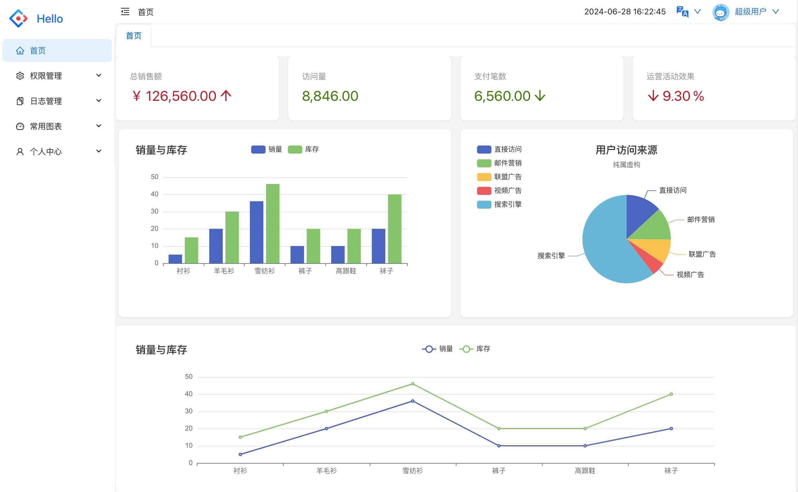
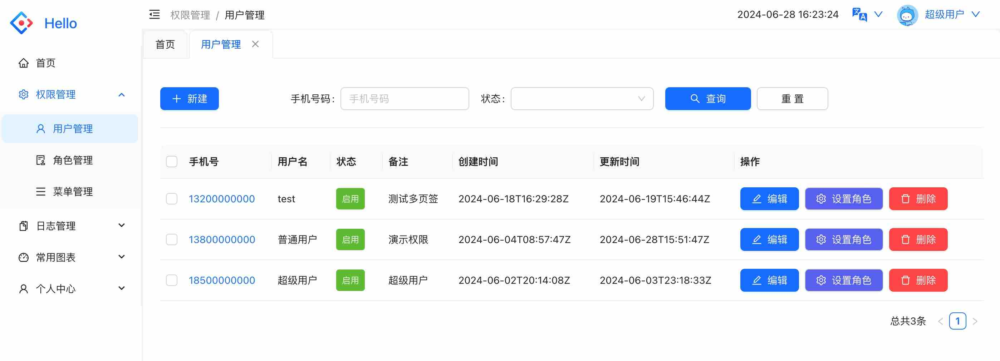
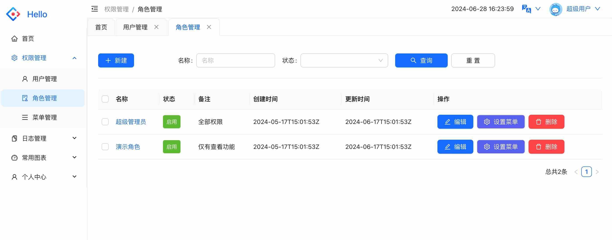
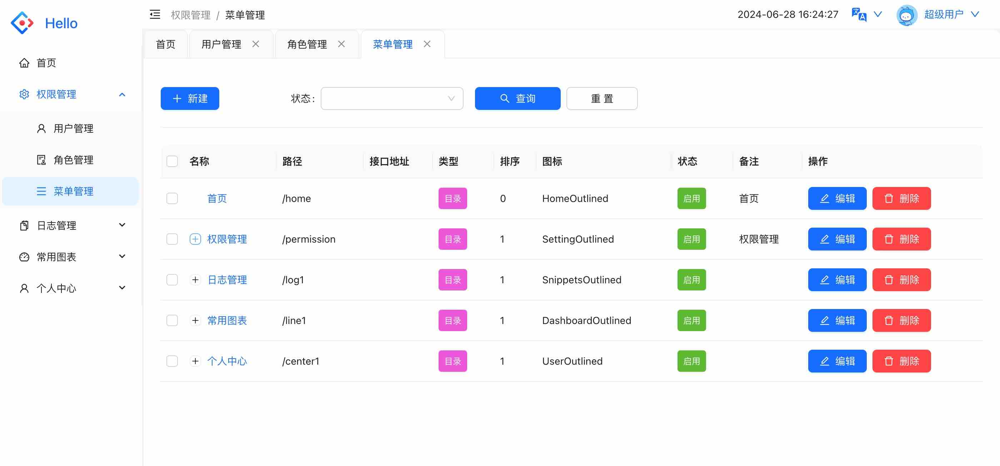

# axum-casbin-admin

基于axum+rbatis+casbin的rbac权限管理系统

# 前端项目

[Create React App](https://github.com/cody-why/antd-admin.git)

# 本地启动

- 创建数据库并导入`\docs\sql`脚本
- 启动 cargo run 
- 验证脚本在httpClient目录下,请求接口前要先执行登录接口(user.http文件中)

# 系统截图

## 首页

## 用户界面

## 角色界面

## 菜单界面

